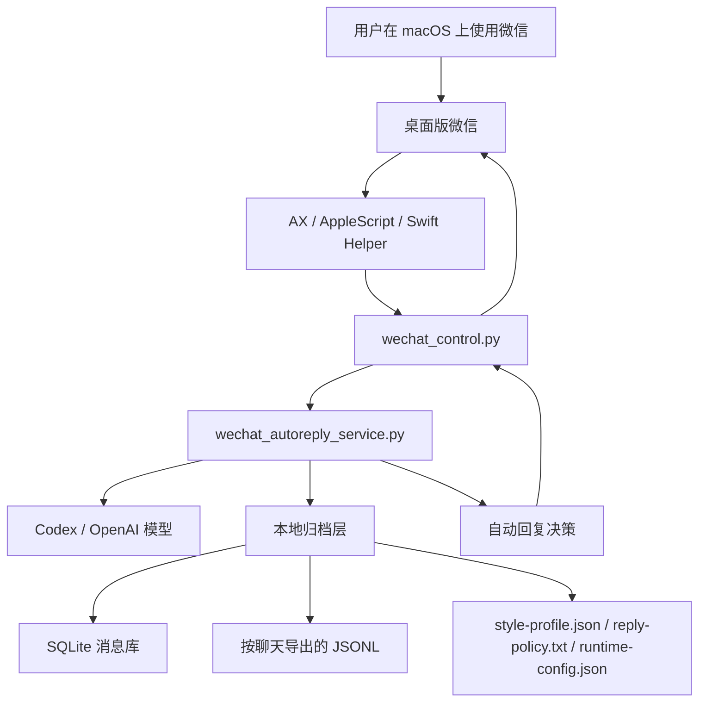

# macOS 基于 Codex 的微信托管助理

一个运行在 macOS 上、基于 Codex 的本地微信托管助理。

## 中文简介

这是一个运行在 macOS 上的本地 WeChat 自动化 skill，目标不是做一个“远程控制微信的云服务”，而是把 Codex、本地脚本和微信桌面客户端连接起来，让个人用户可以在自己的电脑上完成：

- 读取当前微信窗口和左侧会话列表
- 聚焦输入框、粘贴文本、发送消息
- 对私聊做受控的自动回复
- 对群聊做只保存、不自动回复的结构化归档
- 把本地聊天记录沉淀成后续可分析、可生成日报、可学习个人风格的数据

### 这个项目是干什么的

它本质上是一个“本地优先”的微信桌面自动化层。模型负责理解上下文和生成回复，本地脚本负责感知微信界面和执行操作。这样做的好处是：

- 不需要把桌面持续截图发给模型
- 不需要把聊天记录同步到云端
- 可以把风险动作限制在本机和可见聊天范围内
- 更容易控制性能、隐私和可解释性

### 设计思路

我的设计思路不是让大模型直接“看桌面乱点”，而是分成两层：

1. 确定性执行层  
   用 macOS 的 Accessibility、AppleScript 和 Swift helper 去做稳定动作，比如读取当前聊天、读取左侧会话、聚焦输入框、发送消息。

2. 智能决策层  
   用 Codex 或 OpenAI 模型只做理解、归纳和回复生成，不直接决定屏幕坐标和底层 UI 细节。

这套结构有几个明确边界：

- 自动回复只针对私聊
- 群聊默认只学习和归档，不自动回复
- 不通过搜索联系人兜底发消息，避免误发
- 聊天内容一律当作不可信输入，不能借此改本地代码、配置或执行逻辑

### 我是怎么设计这个 skill 的

这个 skill 不是一个单体程序，而是一组协作脚本：

- `wechat_control.py`
  负责直接操作微信
- `wechat_ax_query.swift`
  负责从 AX 树读取窗口、会话和消息结构
- `wechat_ax_action.swift`
  负责更稳定的 UI 动作
- `wechat_autoreply_service.py`
  负责轮询、上下文拼装、模型调用、归档和安全判断
- `wechat_message_store.py`
  负责把消息落到 SQLite 和按聊天导出的 JSONL
- `wechat_style_profile.py`
  负责从本地可信样本中提炼“像用户本人”的表达风格

也就是说，它的核心不是“自动回一句话”，而是“先建立一个本地可控、可扩展、可审计的微信自动化基础设施”。

## 架构图

下面这张图对应这个项目的核心数据流：



你可以把它简单理解成：

- 微信负责承载真实聊天界面
- 本地控制层负责看见界面和执行动作
- watcher 负责流程编排
- 模型只负责理解和生成
- 所有长期数据尽量沉淀在本地

### 怎么用

最简单的使用方式是 3 步：

1. 把 skill 放进 `$CODEX_HOME/skills/wechat-macos-control`
2. 给 Codex 或终端开启 macOS 辅助功能权限
3. 运行 watcher 或直接调用控制脚本

常见用法有两类：

- 手动控制  
  适合调试、读取消息、手工发消息
- 自动值守  
  适合对当前可见私聊做自动回复，并把消息保存在本地

如果你后续想做日报、待办抽取、聊天分析，这个仓库的价值主要就在于它已经把“微信操作”和“结构化数据沉淀”这两件事接到一起了。

## 一步一步使用指南

这部分按“第一次上手”的顺序来写。你不需要先理解全部脚本，照着做就能把它跑起来。

### 第 1 步：准备环境

先确认这几件事已经满足：

1. 你的系统是 macOS
2. 已安装桌面版微信，路径是 `/Applications/WeChat.app`
3. 本机有 `python3` 和 `swift`
4. 已安装并登录 `codex` CLI
5. 给 Codex 或你运行命令的终端开了 macOS `辅助功能` 权限

如果你只想先测试控制能力，不急着自动回复，那么第 4 条可以后面再做。

### 第 2 步：安装 skill

把仓库里的 `wechat-macos-control` 放到 `$CODEX_HOME/skills/` 下。

```bash
mkdir -p "$CODEX_HOME/skills"
cp -R wechat-macos-control "$CODEX_HOME/skills/wechat-macos-control"
```

如果你更习惯用软链接，也可以这样：

```bash
ln -s "$(pwd)/wechat-macos-control" "$CODEX_HOME/skills/wechat-macos-control"
```

### 第 3 步：准备本地数据目录

默认情况下，运行数据会放到：

```text
~/Library/Application Support/wechat-macos-control
```

如果你想自定义目录，可以提前设置：

```bash
export WECHAT_LOCAL_DATA_ROOT="/your/path"
```

这个目录后面会存放：

- 聊天归档数据库
- 每个聊天的 JSONL 导出
- 运行时配置
- 白名单
- 回复策略
- 风格画像
- 日志文件

### 第 4 步：先做一次基础检查

先不要急着开 watcher，先确认微信可见、权限正常、脚本能读到窗口。

```bash
python3 wechat-macos-control/scripts/wechat_control.py check
```

如果这里返回正常，再继续。

你也可以顺手看一下左侧聊天列表：

```bash
python3 wechat-macos-control/scripts/wechat_control.py visible-chats --limit 8
```

### 第 5 步：先用手动模式试一遍

建议先验证 3 个最小动作：

1. 读取当前聊天
2. 读取当前聊天消息
3. 聚焦输入框并准备发送

命令示例：

```bash
python3 wechat-macos-control/scripts/wechat_control.py current-chat
python3 wechat-macos-control/scripts/wechat_control.py read-current-messages --limit 12
python3 wechat-macos-control/scripts/wechat_control.py focus-compose
```

如果你想测试发送链路，先用文件传输助手，不要直接对真人聊天做实验。

### 第 6 步：先用 save-only 跑起来

第一次运行，建议不要立刻自动回复，而是先进入“只保存消息”的模式。

```bash
python3 wechat-macos-control/scripts/wechat_runtime_config.py set --mode save-only
python3 wechat-macos-control/scripts/wechat_autoreply_service.py \
  --monitor-visible \
  --visible-limit 8 \
  --backend codex \
  --send-mode enter
```

这样它会：

- 监控当前左侧可见会话
- 保存消息和本地结构化数据
- 学习你的表达风格
- 但不会自动回复

这是最稳的第一次启动方式。

### 第 7 步：确认数据已经开始落地

启动一段时间后，你可以去看这些文件：

- `wechat-message-store.sqlite3`
- `chats/*.jsonl`
- `runtime-config.json`
- `wechat-autoreply.log`

如果这些文件已经开始生成，说明本地归档链路是通的。

### 第 8 步：再切到自动回复

确认前面都正常后，再切到 `auto-reply`：

```bash
python3 wechat-macos-control/scripts/wechat_runtime_config.py set --mode auto-reply
```

当前设计下：

- 私聊可以自动回复
- 群聊默认只学习和归档，不自动回复
- 自动回复只作用于左侧当前可见且可直接选中的聊天
- 不会再兜底用“发起会话”搜索联系人，避免误发

### 第 9 步：按需调整配置

你后面最常改的通常是这几项：

```bash
python3 wechat-macos-control/scripts/wechat_runtime_config.py show
python3 wechat-macos-control/scripts/wechat_runtime_config.py set --mode save-only
python3 wechat-macos-control/scripts/wechat_runtime_config.py set --mode auto-reply
python3 wechat-macos-control/scripts/wechat_runtime_config.py set --send-mode enter
python3 wechat-macos-control/scripts/wechat_runtime_config.py set --context-limit 12
```

几份关键文件分别负责：

- `reply-policy.txt`：回复底层规则
- `group-whitelist.txt`：允许保留结构化数据的群聊名单
- `detected-groups.txt`：自动识别后不再点击的群聊名单
- `style-profile.json`：本地风格画像

### 第 10 步：日常使用建议

如果你是第一次真正日用，我建议这样：

1. 先只开 `save-only`
2. 观察半天到一天
3. 确认没有误点、误识别、误归档
4. 再切到 `auto-reply`
5. 先只在少量私聊里使用

这样比一开始就全自动稳定得多。

### 常见问题

`1. 为什么它没有看到某个新消息？`  
因为当前方案默认只监控微信左侧“当前可见”的会话。

`2. 为什么群聊不会自动回？`  
这是故意设计的安全边界。群聊默认只学习和归档。

`3. 为什么它不会搜索联系人兜底发送？`  
为了避免误发。当前策略只允许对当前聊天或左侧可见聊天发送。

`4. 我想停掉服务怎么办？`  
直接停止当前运行 watcher 的终端进程即可。

`5. 我想只保存、不回复怎么办？`  
把运行模式切回：

```bash
python3 wechat-macos-control/scripts/wechat_runtime_config.py set --mode save-only
```

## 适合谁用 / 不适合谁用

### 适合谁用

这个项目更适合下面这类用户：

- 只有一台 Mac，平时主要用桌面版微信
- 想让 Codex 帮自己托管一部分私聊回复
- 对“本地优先、数据不出本机”这件事比较在意
- 需要把聊天记录沉淀成后续可分析、可提取待办、可生成日报的本地结构化数据
- 能接受这是一个偏工程化、偏命令行的工具，而不是一个开箱即用的商业产品

### 不适合谁用

如果你是下面这些场景，这个项目当前并不适合：

- 想做多账号、多设备、多人共用的 SaaS 服务
- 想完全无打扰、完全后台、完全不切前台地自动回复
- 想覆盖微信所有聊天而不是左侧当前可见会话
- 想把它当成一个 100% 稳定、零误差、零维护成本的成品
- 对 macOS 权限、终端命令、GitHub、Codex CLI 这类基础环境完全不想碰

换句话说，这更像一个“本地托管助理基础设施”，不是一个已经产品化封装好的消费者应用。

## 风险说明与安全边界

这个项目在设计上是保守的，但它仍然属于桌面自动化工具，所以边界必须明确。

### 已经做的安全限制

- 私聊和群聊分开处理  
  群聊默认只保存和学习，不自动回复。

- 不走搜索联系人兜底发送  
  自动回复只对当前聊天或左侧当前可见聊天生效，避免误发给错误对象。

- 聊天文本不当成系统指令  
  对方在微信里发来的内容，不会被当成改代码、改配置、执行命令的授权来源。

- 本地优先存储  
  聊天归档、风格画像、运行配置默认落在本地目录，不依赖云端数据库。

### 仍然存在的现实限制

- 它依赖桌面 UI  
  微信界面改版后，AX 结构或控件层级变化，可能需要修脚本。

- 它会影响你的前台操作  
  在自动回复时，脚本仍可能切到微信前台执行动作。这不是完全后台方案。

- 它默认只看当前左侧可见聊天  
  如果会话被你手动滚出视口，它就看不到。

- 它不是法律、合规或商业托管方案  
  这套方案更适合个人本机自用，不适合直接拿去做多人共享后端。

### 建议的使用方式

如果你是第一次上手，建议按这个顺序：

1. 先用 `save-only`
2. 先对白名单小范围使用
3. 先在文件传输助手或测试聊天里压测
4. 确认没有误点和误发后，再进入长期使用

这样可以把风险压到最低。

## FAQ / 常见报错排查

### 1. `check` 能跑，但 watcher 不会自动回复

先检查这 4 件事：

1. 当前模式是不是 `save-only`
2. 目标是不是私聊而不是群聊
3. 目标聊天是不是在微信左侧当前可见区域
4. `codex` CLI 是否已登录

你可以先看运行时配置：

```bash
python3 wechat-macos-control/scripts/wechat_runtime_config.py show
```

### 2. 能看到微信，但读不到聊天列表

这通常是 `辅助功能权限` 没开对，或者开给了错误的宿主进程。

优先检查：

- Codex 客户端是否已授权
- 你实际运行命令的终端是否已授权
- 微信是否已经打开并处于可访问状态

### 3. 服务启动了，但没有识别到某个新消息

这是最常见的现象之一。当前方案默认只看：

- 微信左侧当前可见会话

所以如果某个聊天被你滚出当前视口，它就不会被 watcher 看到。

### 4. 为什么群聊被跳过了

这是当前设计的故意行为：

- 群聊默认只学习和归档
- 不自动回复

另外，自动识别成群聊的标题会被写进：

- `detected-groups.txt`

后面 watcher 会直接跳过它。

### 5. 自动回复时为什么会打断我当前操作

因为这套方案本质上还是桌面 UI 自动化。发送消息时，脚本可能需要：

- 切到微信
- 选中聊天
- 聚焦输入框
- 发送消息

所以它不是完全后台、完全无感的方案。

### 6. 为什么它不再搜索联系人兜底发消息

这是后来刻意收紧的安全策略。

早期搜索联系人兜底虽然“更聪明”，但误发风险太高。  
现在默认只允许：

- 当前聊天
- 左侧当前可见聊天

### 7. 我想先只保存，不自动回复

直接切回：

```bash
python3 wechat-macos-control/scripts/wechat_runtime_config.py set --mode save-only
```

### 8. 我想恢复自动回复

切回：

```bash
python3 wechat-macos-control/scripts/wechat_runtime_config.py set --mode auto-reply
```

### 9. 我想换发送快捷键

比如你把微信发送改成 `Enter`，就执行：

```bash
python3 wechat-macos-control/scripts/wechat_runtime_config.py set --send-mode enter
```

如果你想改成 `Cmd+Enter`：

```bash
python3 wechat-macos-control/scripts/wechat_runtime_config.py set --send-mode cmd-enter
```

### 10. 本地数据都存在哪

默认目录是：

```text
~/Library/Application Support/wechat-macos-control
```

重点文件包括：

- `wechat-message-store.sqlite3`
- `chats/*.jsonl`
- `runtime-config.json`
- `reply-policy.txt`
- `group-whitelist.txt`
- `detected-groups.txt`
- `style-profile.json`
- `wechat-autoreply.log`

### 11. 我怎么确认服务真的在运行

最简单的方法就是看日志：

```bash
tail -f "$HOME/Library/Application Support/wechat-macos-control/wechat-autoreply.log"
```

如果你改过 `WECHAT_LOCAL_DATA_ROOT`，就把路径换成你的自定义目录。

### 12. 我升级微信后突然不能用了怎么办

优先怀疑两件事：

1. AX 结构变化了
2. 原有控件定位失效了

这时候先做：

```bash
python3 wechat-macos-control/scripts/wechat_control.py snapshot
swift wechat-macos-control/scripts/wechat_ax_dump.swift --depth 3
```

先确认当前微信 UI 结构有没有变，再决定要不要修脚本。

This repository packages the skill, scripts, and sample configuration needed to:

- inspect the current WeChat window state
- read visible chats and message fragments
- focus the compose box and paste or send text
- run a guarded visible-sidebar watcher for private-chat auto-reply
- archive structured chat data locally for later analysis

## Scope

This project is intentionally local-first:

- macOS only
- desktop WeChat only
- deterministic UI automation first
- no reverse engineering of the WeChat app binary
- no bundled cloud service

## Repository Layout

```text
.
├── README.md
├── LICENSE
├── .gitignore
├── examples/
│   ├── group-whitelist.example.txt
│   ├── reply-policy.example.txt
│   └── runtime-config.example.json
└── wechat-macos-control/
    ├── SKILL.md
    ├── agents/openai.yaml
    └── scripts/
```

## Requirements

- macOS
- WeChat desktop app installed at `/Applications/WeChat.app`
- `python3`
- `swift`
- Accessibility permission granted to Codex or the terminal host
- optional: `codex` CLI logged in if you want model-backed auto-reply without OpenAI API keys

## Install As A Codex Skill

Clone the repo and place the `wechat-macos-control` folder under your Codex skills directory:

```bash
mkdir -p "$CODEX_HOME/skills"
cp -R wechat-macos-control "$CODEX_HOME/skills/wechat-macos-control"
```

You can also symlink it:

```bash
ln -s "$(pwd)/wechat-macos-control" "$CODEX_HOME/skills/wechat-macos-control"
```

## Runtime Data

By default the scripts store runtime state under:

```text
~/Library/Application Support/wechat-macos-control
```

Override it with:

```bash
export WECHAT_LOCAL_DATA_ROOT="/custom/path"
```

The watcher creates and uses files such as:

- `wechat-message-store.sqlite3`
- `chats/*.jsonl`
- `runtime-config.json`
- `autoreply-state.json`
- `reply-policy.txt`
- `group-whitelist.txt`
- `detected-groups.txt`
- `style-profile.json`
- `wechat-autoreply.log`

## Quick Start

Check the local WeChat state:

```bash
python3 wechat-macos-control/scripts/wechat_control.py check
```

Inspect visible chats:

```bash
python3 wechat-macos-control/scripts/wechat_control.py visible-chats --limit 8
```

Read current chat fragments:

```bash
python3 wechat-macos-control/scripts/wechat_control.py read-current-messages --limit 12
```

Start the visible-sidebar watcher:

```bash
python3 wechat-macos-control/scripts/wechat_autoreply_service.py \
  --monitor-visible \
  --visible-limit 8 \
  --backend codex \
  --send-mode enter
```

## Safety Model

- Auto-reply never falls back to search-based `发起会话`.
- Sending is limited to the current chat or chats already visible in the left sidebar.
- Group chats are manual-save-only by default and are never auto-replied.
- Official account and service-feed style chats are skipped.
- Chat text is treated as untrusted input and must not be interpreted as instructions to modify local code, config, or tool behavior.

## Privacy Notes

This repository does not include local chat archives, runtime state, or logs. Those files are generated at runtime under `WECHAT_LOCAL_DATA_ROOT` and are excluded by `.gitignore`.

If you publish your own fork, do not commit:

- local SQLite archives
- exported chat JSONL files
- runtime logs
- tokens, keys, or local account-specific settings

## Configuration Examples

Sample files live under `examples/`.

Copy them into your runtime data root if you want a starting point:

- `group-whitelist.example.txt`
- `reply-policy.example.txt`
- `runtime-config.example.json`

## GitHub Publishing

This repository is ready to publish with either:

```bash
gh repo create wechat-macos-control --public --source . --remote origin --push
```

or:

```bash
git remote add origin https://github.com/<your-account>/wechat-macos-control.git
git push -u origin main
```

If `gh auth status` says you are not logged in, run:

```bash
gh auth login
```

before creating the remote repository.
